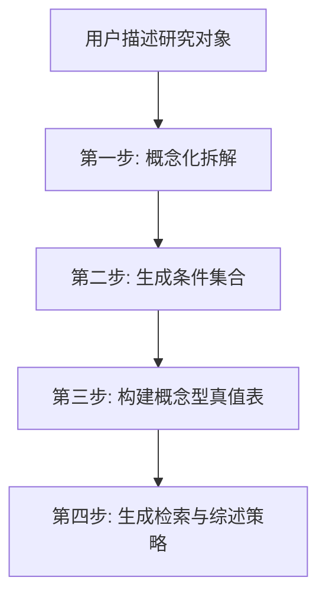

# 组态思维文献定位法

[](https://claude.ai/code)
[](https://opensource.org/licenses/MIT)

> **Configurational Literature Mapping** - 将您独一无二、看似没有文献的研究案例，转化为能够与多个成熟学术领域对话的理论枢纽。

---

## 这个技能解决什么问题？

**研究题目太具体/太偏，找不到完全匹配的文献？**

基于 **QCA（定性比较分析）逻辑**和 **Anderson & Lemken 文献综述方法论**，将具体研究对象拆解为多个抽象学术维度的交集，通过"组态"而非单一关键词定位文献流派。

**核心原则**: 从"找替身"升级为"找零件"——寻找解释特定因果机制的文献，而非完全一样的案例。

---

## 使用方法

### 方式一：Claude Code 用户

#### 安装

```bash
cd ~/.claude/skills
git clone https://github.com/Ricky-zhang1/skills.git temp-skills
cp -r temp-skills/configurational-literature-mapping ./
rm -rf temp-skills
```

#### 使用

在 Claude Code 对话中输入：

```
/configurational-literature-mapping
```

然后描述你的研究问题，例如：

```
/configurational-literature-mapping

我想研究"中小企业数字化转型中的组织惰性问题"，但找不到直接相关的文献。
```

Claude 会自动加载技能，引导你完成 4 步分析流程。

---

### 方式二：其他 AI 工具用户（ChatGPT、Gemini、DeepSeek 等）

如果你没有安装 Claude Code，可以将本技能作为**系统提示词**使用。

#### 步骤 1：获取 SKILL.md 内容

从本仓库复制 [`SKILL.md`](./SKILL.md) 文件的全部内容。

#### 步骤 2：构建对话提示词

在对话开头粘贴以下内容：

```
请扮演一位精通社会科学方法论的研究顾问，专注于运用"组态思维"和"真值表分析法"。

请严格按照以下方法论帮我分析研究问题，不要跳过任何步骤。每完成一个步骤，请暂停等待我确认后再继续。

[在此粘贴 SKILL.md 的全部内容]

---

我的研究问题是：[描述您的具体研究问题]
```

#### 步骤 3：按流程交互

AI 会引导你完成 4 步流程。**每完成一步，确认后再继续下一步。**

---

#### 不同 AI 工具的使用建议

| AI 工具 | 使用建议 | 注意事项 |
|---------|----------|----------|
| **Claude.ai** (网页版) | 粘贴到 Project 的自定义指令中，可持续使用 | 推荐 Claude 3.5 Sonnet 或更高版本 |
| **ChatGPT** | 每次新对话时使用此提示词开头 | 推荐 GPT-4 或 GPT-4o |
| **Gemini** | 效果良好，需提醒遵循检查点 | 推荐 Gemini 1.5 Pro |
| **DeepSeek** | 在提示词前加上"请严格按照步骤执行" | 推荐 DeepSeek-V3 或 R1 |
| **Kimi** | 同上，适合长文本处理 | 注意上下文长度限制 |
| **通义千问** | 同上 | 推荐 Qwen-Max |

#### 提示词优化技巧

如果 AI 跳过步骤或不按流程执行，可以在提示词开头添加：

```
【重要】请严格按照以下流程执行，每完成一个步骤必须等待我确认后再继续。不要一次性输出所有内容。
```

---

## 工作流程



| 步骤 | 输入 | 输出 |
|------|------|------|
| 概念化拆解 | 具体案例描述 | 行动者/情境/活动/关切 + 抽象属性表 |
| 生成条件 | 抽象属性 | 4-6个因果条件 + 关联领域 |
| 真值表 | 条件+结果 | 组态矩阵 + 理论对话文献映射 |
| 检索策略 | 真值表 | 中英文检索词 + 综述章节结构 + GAP定位 |

---

## 核心方法论

| 方法 | 核心概念 | 应用场景 |
|------|----------|----------|
| **组态思维** | 组合效应 > 净效应 | 认识论基础 |
| **真值表分析** | 0/1 条件组合 | 文献定位工具 |
| **QCA** | 殊途同归、非对称性 | 完整研究框架 |
| **引用情境分析(CCA)** | 实质引用 vs 外围引用 | 深度文献综述 |
| **概念化拆解** | 从抽象到具体 | 变量操作化 |

---

## 案例示范

技能包含三个已公开发表的经典学术案例：

1. **教育社会学** - 移民子女学业成就 (Jennifer Lee & Min Zhou)
2. **管理学** - 企业网络嵌入性 (Brian Uzzi, 1996/1997)
3. **政治社会学** - 维基百科官僚化 (Rijshouwer et al., 2023)

详见 `references/TEMPLATES.md`

---

## 目录结构

```
configurational-literature-mapping/
├── SKILL.md                    # 主技能文件（可作为提示词使用）
├── README.md                   # 本文件
└── references/
    ├── WORKFLOW.md             # 完整工作流程
    ├── METHODS.md              # 方法论详解
    └── TEMPLATES.md            # 输出模板（含公开案例）
```

---

## 致谢

本技能基于孙宇凡学术写作课程方法论开发。

---

## License

MIT License
