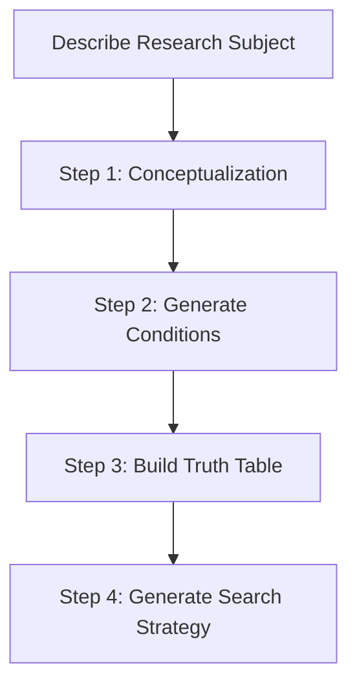
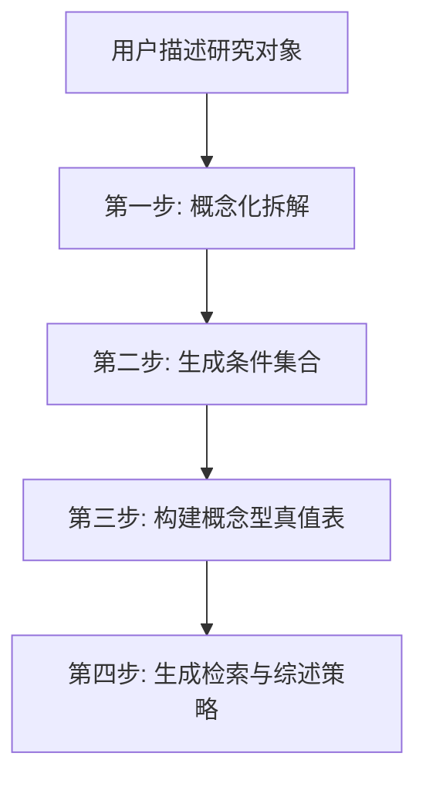

# Configurational Literature Mapping | 组态思维文献定位法

[](https://claude.ai/code)
[](https://opensource.org/licenses/MIT)

**English** | [中文](#中文文档)

---

## English

> **Configurational Literature Mapping** - Transform your unique, seemingly literature-less research case into a theoretical hub capable of dialoguing with multiple established academic fields.

### The Problem

Research topic too specific/niche to find matching literature?

### The Solution

Based on **QCA (Qualitative Comparative Analysis) logic** and **Anderson & Lemken literature review methodology**, decompose concrete research subjects into intersections of multiple abstract academic dimensions, locating literature schools through "configurations" rather than single keywords.

**Core Principle**: Upgrade from "finding substitutes" to "finding parts" — seek literature explaining specific causal mechanisms, not identical cases.

### Installation

#### Method 1: Direct Clone

```bash
cd ~/.claude/skills
git clone https://github.com/Ricky-zhang1/skills.git
# Then copy configurational-literature-mapping to your skills directory
```

#### Method 2: Use as Prompt (For ChatGPT, Gemini, etc.)

**Step 1: Copy the skill content**

Copy the entire content of `SKILL.md` file from this repository.

**Step 2: Start your conversation**

Paste the following at the beginning of your chat:

```
请扮演一位精通社会科学方法论的研究顾问，专注于运用"组态思维"和"真值表分析法"。

请严格按照以下方法论帮我分析研究问题，不要跳过任何步骤。每完成一个步骤，请暂停等待我确认后再继续。

[PASTE SKILL.md CONTENT HERE]

---

我的研究问题是：[描述您的具体研究问题]
```

**Step 3: Follow the workflow**

The AI will guide you through the 4-step process. Confirm each step before moving to the next.

**Tips for best results:**

| AI Tool | Recommendation |
|---------|----------------|
| Claude.ai | Paste in "Project" custom instructions for persistent use |
| ChatGPT | Start new conversation with the prompt each time |
| Gemini | Works well, remind to follow checkpoints |
| Others | Add "请严格按照步骤执行" before the prompt |

### Usage

**In Claude Code:**
```
/configurational-literature-mapping
```

**In other AI tools:**
Describe your problem: "I want to research XXX, but can't find relevant literature"

### Workflow



| Step | Input | Output |
|------|-------|--------|
| Conceptualization | Case description | Actors/Contexts/Activities/Concerns + Abstract attributes |
| Generate Conditions | Abstract attributes | 4-6 causal conditions + Related fields |
| Truth Table | Conditions + Outcomes | Configuration matrix + Theory-literature mapping |
| Search Strategy | Truth table | Keywords + Review structure + GAP positioning |

### Core Methodology

| Method | Core Concept | Application |
|--------|--------------|-------------|
| **Configurational Thinking** | Combination effects > Net effects | Epistemological foundation |
| **Truth Table Analysis** | 0/1 condition combinations | Literature positioning tool |
| **QCA** | Equifinality, Asymmetry | Complete research framework |
| **Citation Context Analysis** | Substantive vs. peripheral citations | Deep literature review |
| **Conceptual Decomposition** | From abstract to concrete | Variable operationalization |

### Case Examples

The skill includes three published academic cases:

1. **Sociology of Education** - Immigrant children's academic achievement (Jennifer Lee & Min Zhou)
2. **Management** | Firm network embeddedness (Brian Uzzi, 1996/1997)
3. **Political Sociology** | Wikipedia bureaucratization (Rijshouwer et al., 2023)

See `references/TEMPLATES.md` for details.

### Directory Structure

```
configurational-literature-mapping/
├── SKILL.md                    # Main skill file (use as prompt)
├── README.md                   # This file
└── references/
    ├── WORKFLOW.md             # Complete workflow
    ├── METHODS.md              # Methodology details
    └── TEMPLATES.md            # Output templates with examples
```

### Acknowledgments

This skill is developed based on academic writing course methodology.

### License

MIT License

---

## 中文文档

> **组态思维文献定位法** - 将您独一无二、看似没有文献的研究案例，转化为能够与多个成熟学术领域对话的理论枢纽。

### 核心问题

研究题目太具体/太偏，找不到完全匹配的文献？

### 解决方案

基于 **QCA（定性比较分析）逻辑**和 **Anderson & Lemken 文献综述方法论**，将具体研究对象拆解为多个抽象学术维度的交集，通过"组态"而非单一关键词定位文献流派。

**核心原则**: 从"找替身"升级为"找零件"——寻找解释特定因果机制的文献，而非完全一样的案例。

### 安装

#### 方法1：直接克隆

```bash
cd ~/.claude/skills
git clone https://github.com/Ricky-zhang1/skills.git
# 然后将 configurational-literature-mapping 复制到您的 skills 目录
```

#### 方法2：作为提示词使用（适用于 ChatGPT、Gemini 等）

**步骤1：复制技能内容**

从本仓库复制 `SKILL.md` 文件的全部内容。

**步骤2：开始对话**

在对话开头粘贴以下内容：

```
请扮演一位精通社会科学方法论的研究顾问，专注于运用"组态思维"和"真值表分析法"。

请严格按照以下方法论帮我分析研究问题，不要跳过任何步骤。每完成一个步骤，请暂停等待我确认后再继续。

[在此粘贴 SKILL.md 的全部内容]

---

我的研究问题是：[描述您的具体研究问题]
```

**步骤3：按流程执行**

AI 会引导您完成 4 步流程。每完成一步，确认后再继续下一步。

**最佳实践建议：**

| AI 工具 | 建议 |
|---------|------|
| Claude.ai | 粘贴到 "Project" 的自定义指令中，可持续使用 |
| ChatGPT | 每次新对话时使用此提示词开头 |
| Gemini | 效果良好，需提醒遵循检查点 |
| 其他工具 | 在提示词前加上"请严格按照步骤执行" |

### 使用方法

**在 Claude Code 中：**
```
/configurational-literature-mapping
```

**在其他 AI 工具中：**
描述您的问题："我想研究 XXX，但找不到相关文献"

### 工作流程



| 步骤 | 输入 | 输出 |
|------|------|------|
| 概念化拆解 | 具体案例描述 | 行动者/情境/活动/关切 + 抽象属性表 |
| 生成条件 | 抽象属性 | 4-6个因果条件 + 关联领域 |
| 真值表 | 条件+结果 | 组态矩阵 + 理论对话文献映射 |
| 检索策略 | 真值表 | 中英文检索词 + 综述章节结构 + GAP定位 |

### 核心方法论

| 方法 | 核心概念 | 应用场景 |
|------|----------|----------|
| **组态思维** | 组合效应 > 净效应 | 认识论基础 |
| **真值表分析** | 0/1 条件组合 | 文献定位工具 |
| **QCA** | 殊途同归、非对称性 | 完整研究框架 |
| **引用情境分析(CCA)** | 实质引用 vs 外围引用 | 深度文献综述 |
| **概念化拆解** | 从抽象到具体 | 变量操作化 |

### 案例示范

技能包含三个已公开发表的经典学术案例：

1. **教育社会学** - 移民子女学业成就 (Jennifer Lee & Min Zhou)
2. **管理学** - 企业网络嵌入性 (Brian Uzzi, 1996/1997)
3. **政治社会学** - 维基百科官僚化 (Rijshouwer et al., 2023)

详见 `references/TEMPLATES.md`

### 目录结构

```
configurational-literature-mapping/
├── SKILL.md                    # 主技能文件（可作为提示词使用）
├── README.md                   # 本文件
└── references/
    ├── WORKFLOW.md             # 完整工作流程
    ├── METHODS.md              # 方法论详解
    └── TEMPLATES.md            # 输出模板（含公开案例）
```

### 致谢

本技能基于学术写作课程方法论开发。

### License

MIT License
