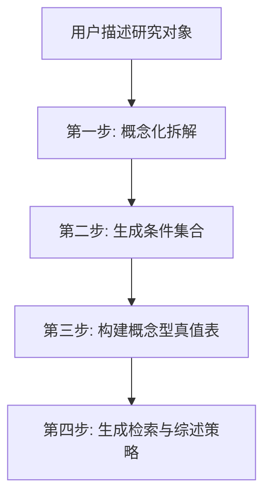

# Configurational Literature Mapping

> **组态思维文献定位法** - 将您独一无二、看似没有文献的研究案例，转化为能够与多个成熟学术领域对话的理论枢纽。

[](https://claude.ai/code)
[](https://opensource.org/licenses/MIT)

## 核心问题

研究题目太具体/太偏，找不到完全匹配的文献？

## 解决方案

基于 **QCA（定性比较分析）逻辑**和 **Anderson & Lemken 文献综述方法论**，将具体研究对象拆解为多个抽象学术维度的交集，通过"组态"而非单一关键词定位文献流派。

**核心原则**: 从"找替身"升级为"找零件"——寻找解释特定因果机制的文献，而非完全一样的案例。

## 安装

### 方法1: 直接安装

```bash
cd ~/.claude/skills
git clone https://github.com/YOUR_USERNAME/configurational-literature-mapping.git
```

### 方法2: 子模块方式

```bash
cd ~/.claude/skills
git submodule add https://github.com/YOUR_USERNAME/configurational-literature-mapping.git
```

## 使用方法

在 Claude Code 中触发此技能：

```
/configurational-literature-mapping
```

或描述你的问题：
> "我想研究 XXX，但找不到相关文献"

## 工作流程



| 步骤 | 输入 | 输出 |
|------|------|------|
| 概念化拆解 | 具体案例描述 | 行动者/情境/活动/关切 + 抽象属性表 |
| 生成条件 | 抽象属性 | 4-6个因果条件 + 关联领域 |
| 真值表 | 条件+结果 | 组态矩阵 + 理论对话文献映射 |
| 检索策略 | 真值表 | 中英文检索词 + 综述章节结构 + GAP定位 |

## 核心方法论

| 方法 | 核心概念 | 应用场景 |
|------|----------|----------|
| **组态思维** | 组合效应 > 净效应 | 认识论基础 |
| **真值表分析** | 0/1 条件组合 | 文献定位工具 |
| **QCA** | 殊途同归、非对称性 | 完整研究框架 |
| **引用情境分析(CCA)** | 实质引用 vs 外围引用 | 深度文献综述 |
| **概念化拆解** | 从抽象到具体 | 变量操作化 |

## 目录结构

```
configurational-literature-mapping/
├── SKILL.md                    # 主技能文件
├── README.md                   # 本文件
└── references/
    ├── WORKFLOW.md             # 完整工作流程
    ├── METHODS.md              # 方法论详解
    └── TEMPLATES.md            # 输出模板（含公开案例）
```

## 案例示范

技能包含三个已公开发表的经典学术案例：

1. **教育社会学** - 移民子女学业成就 (Jennifer Lee & Min Zhou)
2. **管理学** - 企业网络嵌入性 (Brian Uzzi, 1996/1997)
3. **政治社会学** - 维基百科官僚化 (Rijshouwer et al., 2023)

详见 `references/TEMPLATES.md`

## 致谢

本技能基于孙宇凡老师的「社科论文写作训练营」课程方法论开发。

## License

MIT License
