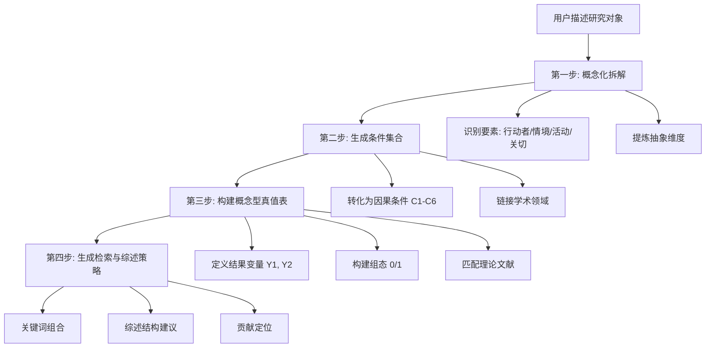

# 组态思维文献定位法

> **核心价值**: 将您独一无二、看似没有文献的研究案例，转化为能够与多个成熟学术领域对话的理论枢纽，彻底解决"文献焦虑"。

## Overview

基于 QCA（定性比较分析）逻辑和 Anderson & Lemken 文献综述方法论的文献检索与框架生成工具。

**核心问题**: 研究题目太具体/太偏，找不到完全匹配的文献

**解决方案**: 将具体研究对象拆解为多个抽象学术维度的交集，通过"组态"而非单一关键词定位文献流派

**核心原则**: 从"找替身"升级为"找零件"——寻找解释特定因果机制的文献，而非完全一样的案例

## When to Use

- 研究对象过于具体，数据库检索结果为零
- 需要将模糊研究兴趣转化为可检索的理论框架
- 构建"两极对立"的深度对话结构
- 定位研究贡献在理论图谱中的位置
- 跨学科寻找理论对话对象

**触发词**: 组态思维、真值表、QCA、文献定位、概念拆解、理论对话、跨学科、学术闭环

## Core Workflow

## Quick Reference

| 步骤 | 输入 | 输出 |
|------|------|------|
| 概念化拆解 | 具体案例描述 | 行动者/情境/活动/关切 + 抽象属性表 |
| 生成条件 | 抽象属性 | 4-6个因果条件(C1-C6) + 关联领域 |
| 真值表 | 条件+结果 | 组态矩阵 + 理论对话文献映射 |
| 检索策略 | 真值表 | 中英文检索词 + 综述章节结构 + GAP定位 |

## Implementation

### 第一步: 概念化与拆解

1. **识别要素**: 从用户描述中提取
   - 行动者 (Actors)
   - 情境 (Contexts)
   - 核心活动/现象 (Activities/Phenomena)
   - 核心关切 (Concerns)

2. **提炼抽象维度**: 将要素转化为学术通用属性
   - 例: "工程研究生" → "新手专业人士" / "受训者"

> **检查点**: 提炼出的"抽象维度"是否足以将您具体的案例连接到更广阔的学术领域（如社会学、教育学、组织学等）？如果无法检索到相关文献，说明抽象程度不够。

**输出格式**: Markdown 表格

### 第二步: 生成条件集合

1. 将抽象维度转化为 **4-6个核心解释条件** (C1-C6)
2. 为每个条件指明关联学术领域
   - 例: C1 → "角色理论"

> **检查点**: 每个"条件"是否对应一个清晰的学术概念或理论辩论？能否直接用它作为关键词在 Scopus/Web of Science 中检索到一批文献？如果不行，需要重新操作化。

### 第三步: 构建概念型真值表

1. **定义结果 (Y)**: 将核心关切拆解为1-2个具体、可测量的结果变量
   - ✅ 好: "论文发表数量"、"创业意向得分"
   - ❌ 差: "综合能力提升"（太模糊）

2. **构建组态**: 用 0/1 表示条件的无/有
   - **必须包含"反事实组合"**：即导致结果未发生的组合，这是发现理论 GAP 的关键

3. **匹配文献**: 每个组态对应的理论对话流派
   - ⚠️ **核心原则**: 不要寻找和你的案例一模一样的文献，而是寻找分别深入研究你"条件C1"、"条件C2"……的文献群

**输出格式**: 包含"组态、条件组合、结果推测、对应文献"的表格

### 第四步: 生成检索与综述策略

1. **关键词组合**: 中英文检索词
2. **综述结构**: 按组态组织章节
3. **贡献定位**: GAP 位于"反事实预期"或"混合张力"

> **贡献定位提示**: 您的独特价值很可能不在于发现了某个全新条件，而在于揭示了条件C1与条件C2在"您的情境"中如何以一种前人未充分讨论的方式相互作用。请据此阐述您的贡献。

## Core Methodology References

| 方法 | 核心概念 | 应用场景 |
|------|----------|----------|
| **组态思维** | 组合效应 > 净效应 | 认识论基础 |
| **真值表分析** | 0/1 条件组合 | 文献定位工具 |
| **QCA** | 殊途同归、非对称性 | 完整研究框架 |
| **引用情境分析(CCA)** | 实质引用 vs 外围引用 | 深度文献综述 |
| **概念化拆解** | 从抽象到具体 | 变量操作化 |

## Common Mistakes

| 错误 | 修正 |
|------|------|
| 条件过多 (>8个) | 保留 4-6 个核心条件 |
| 抽象层次不一致 | 统一使用学术界通用概念 |
| 忽略"殊途同归" | 每个结果至少 2-3 条路径 |
| 文献匹配过窄 | 按"逻辑相似"而非"案例相同"匹配 |
| 条件无法操作化 | 必须将模糊概念（如"氛围好"）转化为可观察变量（如"正式指导的频率"） |
| 结果定义模糊 | 结果应是具体、可测量的（如"论文发表数量"），而非"综合能力提升" |

## Red Flags

- ⚠️ **坚持寻找"完美匹配"的文献** → 应立即引导：本方法的目的是"组装零件"，而非"寻找替身"
- 条件变量过于具体 → 应抽象化
- 真值表只有一行 → 需增加理论张力
- 缺少"反事实组合" → 必须包含导致结果未发生的组态

## Related Skills

| 技能 | 分工 |
|------|------|
| **configurational-literature-mapping** (本技能) | 前期定位与框架搭建，绘制文献地图 |
| **literature-review** | 后期具体的综述写作与合成 |
| **hypothesis-generation** | 在此框架基础上提出具体假设 |
| **社科论文评审专家** | 论文完成后的评审与修改 |

## References

详见 `references/` 目录:
- `WORKFLOW.md` - 完整工作流程
- `METHODS.md` - 方法论详解
- `TEMPLATES.md` - 输出模板
