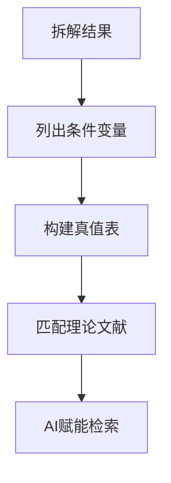
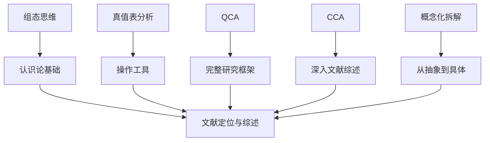

# 方法论详解

本文档详细说明组态思维文献定位法的五大方法论基础。

---

## 一、组态思维 (Configurational Thinking)

### 核心定义

组态思维（又称集合思维 Set Thinking）是一种看待社会现象的认知方式，认为社会结果**并非由单一因素独立导致**，而是由**多个条件变量在特定组合下共同作用**产生的。

### 核心特征

| 特征 | 描述 |
|------|------|
| **因果复杂性** | 单一因素在不同情境下可能产生相反结果 |
| **殊途同归** | 同一结果可以有多种不同路径 |
| **非对称性** | 导致结果出现的原因，其反面不一定导致结果不出现 |

### 与变量导向思维的区别

| 维度 | 变量导向思维 | 组态思维 |
|------|-------------|----------|
| **核心逻辑** | "净效应" | "组合效应" |
| **提问方式** | "控制其他变量，X对Y有多大影响？" | "在什么条件下，X会与其他因素结合导致Y？" |
| **因果观** | 线性、累加 | 非线性、交互 |
| **目标** | 寻找普遍通则 | 寻找特定解释路径 |
| **处理异常** | 视为"误差/噪音" | 视为新的"组态"，值得单独研究 |

### 应用场景

1. 利用"真值表"锁定文献与对话对象
2. 精细化研究贡献
3. 处理定性与定量的结合

---

## 二、真值表分析 (Truth Table Analysis)

### 核心定义

真值表分析是一种借用 QCA 逻辑的**高级文献定位与对话策略**，核心目的是解决"研究题目太具体/太偏，找不到完全匹配文献"的痛点。

### 操作步骤（5步法）



#### Step 1: 拆解结果
将笼统结果拆分为具体可观测指标

**示例：**
```
"亚裔成功" → Y1（学业高成就）+ Y2（职业集中在STEM）
```

#### Step 2: 列出条件变量
列出可能导致结果的关键因素（6-8个）

**示例条件：**
- A：选择性移民（高学历父母）
- C：族裔社群资源
- D：家庭高期待
- E：学校优势轨道
- F：教师正向预期

#### Step 3: 构建概念型真值表
排列组合条件的有（1）无（0）

#### Step 4: 匹配理论文献
每一行组态代表一种现实情况，寻找专门解释这种情况的理论流派

#### Step 5: AI赋能检索
利用AI精准找文献

### 核心价值

| 价值 | 描述 |
|------|------|
| **从"找替身"到"找零件"** | 不找完全一样的案例，找解释同一机制的文献 |
| **两极对立的深度对话** | 建立理论张力 |
| **精准定位研究贡献** | 明确GAP位置 |

---

## 三、QCA 定性比较分析 (Qualitative Comparative Analysis)

### 核心定义

QCA 是一种基于**集合论**和**布尔代数**的研究方法，旨在整合定性研究（个案导向）和定量研究（变量导向）的优势。

### 核心原理

| 原理 | 描述 |
|------|------|
| **组态思维** | 结果由多个条件以特定方式组合而成 |
| **殊途同归** | 导致同一结果可以有多种不同路径 |
| **非对称性** | 导致结果出现的原因，其反面不一定导致结果不出现 |

### fsQCA 模糊集定性比较分析

**定义：** 引入"模糊集"概念，允许条件变量具有部分隶属度

**特点：**
- 变量值不仅仅是 0 或 1，可以是 0 到 1 之间的任何数值
- 更符合社会现实（社会现象往往不是非黑即白）

**关键操作：** 校准（Calibration）
- 将原始数据转化为模糊集分数

---

## 四、引用情境分析 (Citation Context Analysis, CCA)

### 别名
Anderson Lemken 文献综述方法

### 核心定义

一种结合**定量（引用计数）**与**定性（内容分析）**的综述方法，通过分析经典文献被引用的**具体语境**，来评估理论的**实际影响力**和**演变路径**。

### 核心思想

> 引用的本质是对话，意义是在引用过程中被社会性地构建出来的

### 关键区分

| 引用类型 | 特征 |
|----------|------|
| **实质性引用** | 真正推动理论发展 |
| **外围引用** | 肤浅的提及 |

### CCA 能回答的8个核心问题

1. **引用内容**：后人引用了原作的哪个具体观点？
2. **引用性质**：是实质性引用还是肤浅提及？
3. **时间演变**：引用焦点随时间发生了什么变化？
4. **实证检验**：有多少引用提供了实证证据？
5. **批判声音**：有多少引用是批判性的？
6. **遗忘/扭曲**：原作的哪些观点被忽视或误读？
7. **跨学科**：不同学科的解读有何不同？
8. **共引关系**：原作经常和哪些书一起被引用？

### 操作步骤（7步法）

1. 确定领域与问题
2. 设定边界
3. 收集引用情境
4. 制定编码
5. 进行编码
6. 信度检查
7. 报告结果

---

## 五、概念化拆解 (Conceptual Decomposition)

### 核心定义

概念化是将模糊的、不精确的"意象"转化为特定的、明确的意义的过程。它特指将一个**宽泛的研究主题或理论概念**，拆解为若干个**维度、指标或组态成分**的操作。

### 核心逻辑

| 逻辑 | 描述 |
|------|------|
| **从整体到局部** | 不把研究对象看作黑箱，而是多个要素的集合 |
| **从抽象到具体** | 将无法直接测量的概念转化为可观察的行为/数据 |
| **从标签到机制** | 不满足于贴标签，而是拆解内部运作逻辑 |

### 四种操作方法

| 方法 | 应用场景 | 操作步骤 |
|------|---------|---------|
| **拆解研究对象** | 选题和文献锁定阶段 | 将研究对象拆解为空间+时间+群体+活动的集合 |
| **拆解研究问题** | 将模糊兴趣转化为可执行问题 | 将"为什么"问题拆解为具体的"是什么"问题 |
| **拆解理论概念** | 文献综述写作中界定核心概念 | 使用"构件描述论证"句式（P = P1 + P2） |
| **拆解文献逻辑** | 深度阅读时 | 提取概念界定、因果词汇和逻辑区分 |

### 核心价值

1. **去魅与具体化**：消除"大词"的模糊性
2. **发现GAP**：只有把大概念拆解后，才能发现前人忽略的维度
3. **精准定位文献**：找到"逻辑相似但案例不同"的对话对象

---

## 方法论整合

这五个方法论概念构成一个完整的体系：



**整合应用：**
1. 用**组态思维**建立认识论基础
2. 用**概念化拆解**将具体问题转化为抽象维度
3. 用**真值表分析**系统化排列组合条件
4. 用**QCA**框架构建完整研究设计
5. 用**CCA**进行深度文献综述
