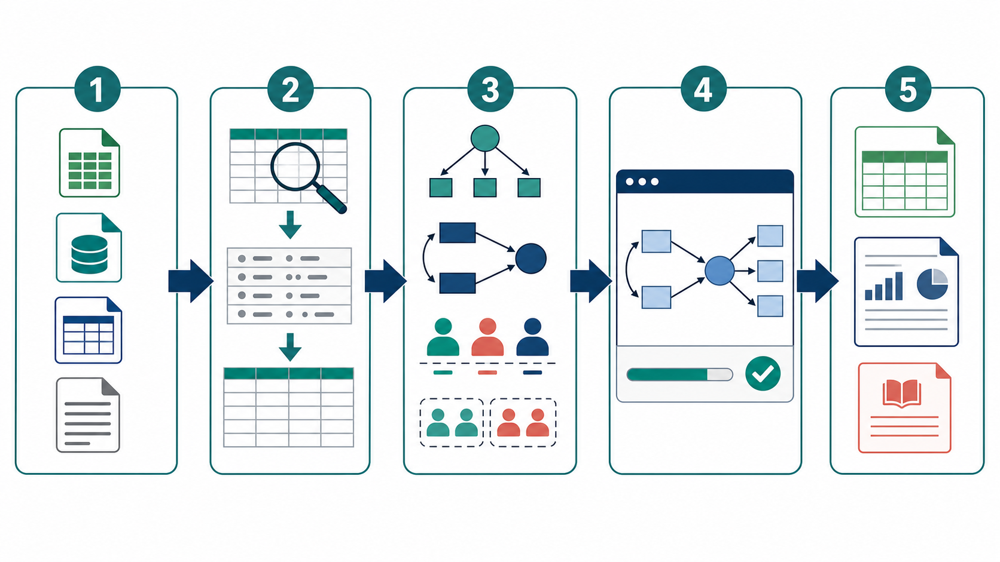

# Mplus自动化分析skill

[](https://github.com/Ricky-zhang1/skills/releases/tag/v0.3.0-alpha.9)
[](./LICENSE)
[](#平台与测试状态)

一个面向学位论文和实证研究的 AI 协作式 Mplus 工作流。它把数据转换、分析设计、受控代码生成、Mplus 运行、结果导出和报告整理接在一起，减少 SAV、TXT、CSV、Excel 和 Mplus 输出之间反复切换的麻烦。

> 这是一个纯分享的 Alpha 项目。它适配 macOS 和 Windows，但完整实机测试目前只在 Mac M 系列芯片加 Mplus 8.3 的环境完成。Windows、Mac Intel 和其他 Mplus 版本必须先完成本机自检，不能视为已经实机认证。



## 快速入口

- [下载 Alpha 9 安装包](https://github.com/Ricky-zhang1/skills/releases/tag/v0.3.0-alpha.9)
- [安装与第一次运行](#安装与第一次运行)
- [支持范围](#支持范围)
- [平台与测试状态](#平台与测试状态)
- [隐私与数据处理](#隐私与数据处理)
- [English](#english)

## 它解决什么问题

我以前在小红书分享 Mplus 经验，大家最常问的往往还没到模型本身。SAV 怎么导出。TXT 怎么转成 Excel 能打开的 CSV。变量顺序乱了怎么办。Mplus 跑完以后，结果怎样整理成能用的表。

这个 Skill 面向这类重复又容易出错的步骤。把数据和研究问题交给 Agent 后，它会读取数据、检查变量与缺失值、生成 Mplus 可读取的数据文件、选择受控的分析路线、生成代码、运行本机 Mplus，并整理 Excel、CSV、报告和参考依据。

## 安装与第一次运行

### 准备条件

1. 你需要自己合法安装 Mplus。Skill 不下载 Mplus，也不绕过许可证。
2. 不需要 MCP Server。
3. Python 和读取 SAV、Excel、CSV、DTA 所需依赖会在首次运行时检测。缺少时，Agent 应先解释用途并征得同意，再为 Skill 创建独立环境。

### Codex

在 Codex 中直接说下面这句话即可。

```text
$skill-installer install https://github.com/Ricky-zhang1/skills/tree/main/mplus-automated-analysis-skill
```

安装完成后重启 Codex。手动安装时，请把完整文件夹放入 `~/.codex/skills/`，不要只复制 `SKILL.md`。

### Claude Code

下载本仓库或克隆仓库后，把完整的 `mplus-automated-analysis-skill` 文件夹复制到 `~/.claude/skills/`，再重启 Claude Code。

### 其他 Agent

使用该平台的 Skill 或插件导入入口，导入整个文件夹。平台至少需要能读取 `SKILL.md`、`references`、`runtime`、`scripts` 和 `assets`。本项目没有为每一种 Agent 单独制作安装器，因此导入界面和文件夹位置以具体平台的说明为准。

### 第一次启动

安装后，先把下面这句话交给 Agent。

> 请先检测本机的 Mplus 和运行环境，并完成一次本机自检。

Skill 会自动寻找 Mplus。只有自动检测失败时，Agent 才应询问安装位置。手动检测可使用下面的命令。

macOS

```bash
./scripts/运行Mplus分析.sh doctor
```

Windows PowerShell

```powershell
.\scripts\运行Mplus分析.ps1 doctor
```

自检通过表示本机 Mplus、数据转换、代码运行和关键输出解析能够连起来工作。它不表示任意真实数据都适合某个模型。

## 怎样使用

把数据文件和研究问题直接交给 Agent。当前支持 SAV、Excel、CSV、DTA、TXT 和 DAT。

你可以从下面的表述开始。

```text
请读取这份 SAV 数据，检查变量和缺失值。我想用第 3 到第 8 题做 CFA。
```

```text
请把这份 TXT 数据整理成 Excel 能直接打开的 CSV，同时保留原始变量顺序。
```

```text
请用这几个指标做 LPA，比较一到五类。不要自动标准化，分析后告诉我类别数选择依据。
```

```text
这是一个三波追踪数据。请先判断能否做基础潜在增长模型，再告诉我还需要确认哪些设定。
```

Agent 应优先从数据和对话中提取信息，只有变量角色、缺失编码、时间点、类别范围或研究设计会影响分析时才继续追问。

## 支持范围

| 分析类型 | 当前状态 | 说明 |
|---|---|---|
| EFA | 标准流程 | 连续和分类指标的受控流程 |
| CFA | 标准流程 | 连续和分类指标的受控流程 |
| SEM 与中介 | 标准流程 | 连续潜变量 SEM，观测或潜变量中介 |
| 基础线性增长 | 标准流程 | 二次、分段和平行过程仍需其他实现 |
| LPA | 标准流程 | 连续指标等方差、类内零协方差的基础模型 |
| LCA | 标准流程 | 分类指标的一到 K 类比较与类别归属导出 |
| 测量不变性、多层、GMM、LCGA、LTA、RI-CLPM、ESEM、复杂抽样 | 引导或专家路径 | 不宣传为已认证的一键分析 |

标准流程代表代码生成路径、运行后核对和输出整理受到控制。它不替代研究者对研究设计、量表质量、缺失机制和理论解释的判断。

## 结果与审查

每次分析都会新建项目目录，原始数据不会被覆盖。常见输出包括。

- 数据质量检查报告和变量对应表
- Mplus 可读取的数据文件和分析设计清单
- 可追溯的 Mplus 代码和逐段说明
- Mplus 原始输出
- 可直接用 Excel 打开的结果表和 CSV
- 中文分析报告、代码模板来源和方法判断依据

Skill 不会静默删除异常值、填补缺失值或做 Z 标准化。样本量不足不会阻止运行，但报告会给出风险提示和规划参考。

LPA 与 LCA 不会只根据一个指标选类别数。流程会综合 BIC、TECH11、TECH14、类别规模、后验概率、稳定性和实质解释。最终类别命名和理论解释仍由研究者完成。

## 平台与测试状态

| 环境 | 状态 |
|---|---|
| Mac Apple Silicon 加 Mplus 8.3 | 已实机测试。覆盖 LPA、EFA、连续和分类 CFA、SEM、Bootstrap 中介、LCA 与基础线性增长。 |
| Windows x64 | 提供路径检测、PowerShell 启动方式和本机自检流程。尚未完成 Windows 真机回归。 |
| Mac Intel | 保留兼容设计。尚未实机验证。 |
| Mplus 9.x | 识别版本并保留适配边界。尚未完成实机回归。 |

每台电脑在第一次正式分析前都应运行自检。更换电脑、Mplus 版本或 Skill Runtime 后，应重新自检。

## 隐私与数据处理

公开仓库不包含任何研究数据、问卷内容、测试输出或个人绝对路径。`.gitignore` 默认排除常见原始数据和分析项目目录。

实际分析时，原始数据副本、转换数据、Mplus 输出和报告都保留在用户本机的新项目目录中。分享项目文件夹前，请自行检查其中是否仍含有可识别个人信息。

## 常见问题

| 情况 | 建议 |
|---|---|
| Agent 找不到 Mplus | 先让 Agent 运行环境检测。自动检测失败后，再提供 Mplus 安装文件夹或可执行文件。 |
| 缺少 Python 依赖 | 让 Agent 解释需要安装什么。确认后再运行环境配置。 |
| LPA 因低基数指标停止 | 检查变量是否实际为等级或分类数据。只有研究者确认可按连续变量处理时才继续。 |
| Mplus 正常结束但报告提示重大问题 | 不要直接用于论文。先查看原始输出和质量审查文件。 |
| 需要高级模型 | 先阅读 `references/支持矩阵.md`，确认它属于标准、引导还是专家路径。 |

## 方法依据与引用

LPA 基础模型和类别数判断引用 Mplus User's Guide Example 7.9、Mplus Web Note 14、Nylund 等人的模拟研究与 Masyn 的综述。其他标准模型的来源登记在 `references/来源登记.yaml`，分析生成的报告也会输出对应方法依据。

在论文中使用本 Skill 时，请引用实际使用的统计方法和 Mplus 官方资料。这个项目可以在致谢、代码可得性或分析流程说明中注明，不应替代方法学文献引用。

## 反馈与版本

这是 Alpha 项目。提交问题时，请写明 Agent 平台、操作系统、Mplus 版本、数据格式、分析类型和完整错误信息。不要上传原始研究数据或可识别个人信息。

更新记录见 [CHANGELOG.md](./CHANGELOG.md)。

## License

[MIT](./LICENSE)

---

# English

## What this Skill does

Mplus Automated Analysis Skill is an AI-assisted workflow for empirical research. It connects data conversion, structured model planning, controlled Mplus syntax generation, local Mplus execution, Excel and CSV exports, Chinese reporting, and methodological references.

It is useful when routine work gets in the way of analysis. Examples include converting TXT files into Excel-readable CSV files, preserving variable order, preparing SAV or Excel data for Mplus, organizing output, and comparing latent profiles or classes.

> This is an Alpha sharing project. It includes macOS and Windows discovery and launcher paths. Complete real-machine testing has so far been performed only on Apple Silicon Mac hardware with Mplus 8.3.

## Installation

### Codex

Use the Skill Installer in Codex with this GitHub directory URL.

```text
$skill-installer install https://github.com/Ricky-zhang1/skills/tree/main/mplus-automated-analysis-skill
```

Restart Codex after installation. Manual installation uses the complete folder in `~/.codex/skills/`.

### Claude Code

Download or clone this repository, copy the complete `mplus-automated-analysis-skill` folder into `~/.claude/skills/`, then restart Claude Code.

### Other agents

Import the entire folder through the platform's Skill or plugin interface. The platform needs access to `SKILL.md`, `references`, `runtime`, `scripts`, and `assets`. Installation details vary by platform.

## Requirements and first run

Users need a valid local Mplus installation. This Skill does not install Mplus or bypass its license, and it does not require an MCP Server.

After installation, ask the Agent to detect local Mplus and complete a local self-test. It checks Python and data-reading dependencies, explains any required setup, and asks for permission before creating its isolated environment.

Manual diagnostics use `./scripts/运行Mplus分析.sh doctor` on macOS or `.\scripts\运行Mplus分析.ps1 doctor` in Windows PowerShell.

## Standard workflows

| Family | Current scope |
|---|---|
| EFA and CFA | Controlled continuous and categorical workflows |
| SEM and mediation | Continuous latent-variable SEM plus observed or latent mediation |
| Linear growth | Basic linear latent growth workflow |
| LPA | Continuous indicators with the registered equal-variance, within-class zero-covariance baseline |
| LCA | Categorical one-through-K class comparison and class-assignment export |
| Advanced models | Measurement invariance, multilevel models, GMM, LCGA, LTA, RI-CLPM, ESEM, and complex survey analysis remain guided or expert paths |

Standard workflows control code generation, post-run checks, and exports. They do not replace research design, measurement assessment, missing-data decisions, or theoretical interpretation.

## Data handling and support

The public repository contains no research data, questionnaires, test output, or personal absolute paths. The included ignore rules exclude common raw-data files and generated analysis folders.

When reporting a problem, include the Agent platform, operating system, Mplus version, data format, analysis type, and the complete error message. Do not upload raw research data or personally identifiable information.

## License

[MIT](./LICENSE)
